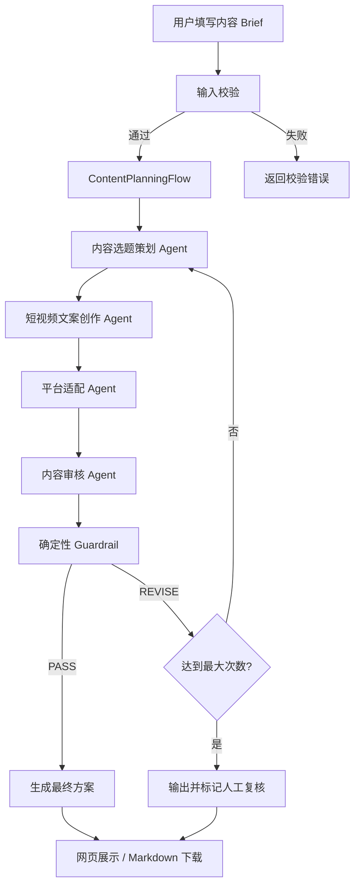

# 多平台短视频内容策划 Agent

一个基于 CrewAI、DeepSeek 和 Streamlit 的多智能体内容策划系统。

用户输入产品、目标人群、营销目标、发布平台、内容风格和真实卖点后，系统会依次完成用户洞察、选题策划、短视频文案创作、抖音与小红书平台适配、内容审核和风险检查，并输出一份完整的 Markdown 内容方案。

## 功能特性

- 用户痛点、使用场景和产品卖点分析
- 多方向选题策划与主选题选择
- 3 秒钩子、口播稿、分镜和 CTA 生成
- 抖音短视频脚本适配
- 小红书图文种草内容适配
- 四个专业 Agent 顺序协作
- Flow 状态管理与条件路由
- 审核失败自动返工
- 未授权数字参数检查
- 高风险营销表达检查
- 最大重试次数与人工复核状态
- Streamlit 可视化工作台
- Markdown 结果下载
- DeepSeek API 接入

## 可视化工作台

网页左侧用于填写产品 Brief，右侧展示 Agent 团队、运行状态和生成结果。

结果分为五个区域：

- 内容策略
- 母版文案
- 平台方案
- 审核报告
- 完整 Markdown

启动后访问：

```text
http://localhost:8501
```

## 系统架构



## Agent 设计

| Agent | 主要职责 | 输出 |
| --- | --- | --- |
| 内容选题策划 Agent | 分析人群痛点、使用场景、卖点和内容方向 | 用户洞察、三个选题、主选题、风险边界 |
| 短视频文案创作 Agent | 将策略转换为可拍摄的母版内容 | 标题、钩子、口播、分镜、CTA |
| 平台适配 Agent | 将母版内容分别适配到目标平台 | 抖音方案、小红书方案 |
| 内容审核 Agent | 检查真实性、合规性、平台差异和完整度 | `PASS` 或 `REVISE` 审核报告 |

四个 Agent 使用 `Process.sequential` 顺序执行。后续任务通过 CrewAI Task Context 读取上游结果：

```text
内容策略 → 母版文案 → 平台适配 → 内容审核
```

## Flow 与 Crew

### Crew

Crew 负责内容生产：

- 创建四个专业 Agent
- 创建相互依赖的 Task
- 按顺序执行任务
- 保存每个阶段的输出

### Flow

Flow 负责业务控制：

- 校验产品、目标人群和平台
- 保存结构化运行状态
- 调用 Crew
- 判断审核结果
- 触发自动返工
- 控制最大审核次数
- 处理异常
- 组装最终 Markdown

这种设计将需要创造力的内容任务交给 LLM，将流程、重试和终止条件保留在代码中。

## 审核与自动返工

审核 Agent 必须使用以下状态之一作为输出开头：

```text
REVIEW_STATUS: PASS
```

```text
REVIEW_STATUS: REVISE
```

当内容需要修改时，Flow 会把审核意见作为 `revision_feedback` 传入下一轮 Crew，使各 Agent 根据具体问题重新生成内容。

系统使用 `max_review_attempts` 限制运行次数，避免无限循环。达到上限仍未通过时，结果会保留，但标记为“建议人工复核”。

## 确定性 Guardrail

内容不能只依赖 LLM 自己审核。系统在审核 Agent 之后增加了代码规则，用于检查更适合确定性处理的风险。

### 未授权量化参数

系统会识别以下类型的数字：

- 百分比
- 毫秒
- 小时
- 重量
- 其他常见产品量化参数

如果平台内容出现的具体数字没有包含在用户提供的真实卖点中，Guardrail 会要求返工。

### 高风险营销表达

系统还会检查：

- 绝对化承诺
- 未经证实的效果描述
- 容易误导用户的购买引导
- 需要真实数据支撑的体验结论

Guardrail 与审核 Agent 形成两层质量控制：

```text
LLM 语义审核 + 代码确定性校验
```

## 抖音与小红书适配

### 抖音

- 单条短视频标题
- 前 3 秒钩子
- 60 秒以内口播
- 分镜表
- 行动引导
- 话题标签

### 小红书

- 多个种草标题
- 封面文案
- 分段正文
- 卖点清单
- 购买建议
- 话题标签

平台 Agent 被要求生成不同的表达结构，而不是简单替换标题。

## 技术栈

- Python 3.10+
- CrewAI
- CrewAI Flow
- DeepSeek API
- LiteLLM
- Pydantic
- Streamlit
- Pytest

## 项目结构

```text
.
├── .streamlit/
│   └── config.toml       # 网页主题与客户端配置
├── src/
│   ├── agents.py         # DeepSeek 配置与四个 Agent
│   ├── tasks.py          # 内容策略、文案、平台和审核任务
│   ├── crew.py           # Crew 组装与顺序执行
│   ├── flow.py           # 状态、路由、Guardrail 与自动返工
│   ├── main.py           # 命令行入口
│   └── web_app.py        # Streamlit 可视化工作台
├── tests/
│   ├── test_flow_helpers.py
│   └── test_web_app.py
├── output/               # 本地生成结果
├── .env.example
└── pyproject.toml
```

## 本地运行

### 1. 创建环境

```powershell
python -m venv .venv
.\.venv\Scripts\Activate.ps1
pip install -e ".[dev]"
```

### 2. 配置 DeepSeek

```powershell
Copy-Item .env.example .env
```

编辑 `.env`：

```env
DEEPSEEK_API_KEY=你的DeepSeek_API_Key
DEEPSEEK_BASE_URL=https://api.deepseek.com
DEEPSEEK_MODEL=deepseek/deepseek-chat
CREWAI_TRACING_ENABLED=false
```

真实 API Key 不应提交到 Git。

### 3. 启动可视化界面

```powershell
streamlit run src/web_app.py
```

访问：

```text
http://localhost:8501
```

### 4. 使用命令行

```powershell
python -m src.main "无线蓝牙耳机" `
  --audience "大学生" `
  --goal "提升购买转化" `
  --platforms "抖音,小红书" `
  --style "年轻、真实、自然" `
  --selling-points "低延迟、续航时间长、佩戴轻便" `
  --max-retries 2
```

生成结果保存在 `output/`。

## 输入说明

| 参数 | 说明 | 示例 |
| --- | --- | --- |
| product | 产品或服务 | 无线蓝牙耳机 |
| audience | 目标人群 | 大学生 |
| goal | 营销目标 | 提升购买转化 |
| platforms | 发布平台 | 抖音,小红书 |
| style | 内容风格 | 年轻、真实、自然 |
| selling_points | 已确认的真实卖点 | 低延迟、续航时间长、佩戴轻便 |
| max_review_attempts | 最大审核次数 | 2 |

`selling_points` 是内容事实边界。建议只填写能够确认的信息；如果产品确实拥有具体续航、重量或延迟数据，也应在这里明确提供。

## 输出结构

```text
产品多平台内容策划方案
├── 内容策略
│   ├── 用户洞察
│   ├── 产品卖点
│   ├── 三个选题
│   ├── 主选题
│   └── 风险边界
├── 母版文案
│   ├── 标题
│   ├── 3 秒钩子
│   ├── 口播稿
│   ├── 分镜
│   └── CTA
├── 平台适配方案
│   ├── 抖音
│   └── 小红书
└── 内容审核报告
```

## 自动化测试

```powershell
pytest -q
```

当前测试覆盖：

- 正常 Brief 校验
- 空产品校验
- 不支持平台校验
- `PASS` / `REVISE` 状态识别
- 未授权量化参数检查
- 高风险营销表达检查
- 审核说明误报过滤
- Streamlit 页面基础渲染

## 当前边界

- 当前只支持抖音和小红书
- 平台规范主要由 Prompt 与本地规则维护
- 每次返工会重新运行完整 Crew
- 生成结果以 Markdown 为主
- 当前未接入品牌知识库、历史内容和实时热点
- 运行速度和费用受模型响应及重试次数影响

## 后续计划

- [ ] 使用 Pydantic 定义结构化内容输出
- [ ] 只重新执行存在问题的任务节点
- [ ] 接入品牌手册和历史内容 RAG
- [ ] 增加热点搜索工具
- [ ] 将平台规则和风险词配置化
- [ ] 建立内容质量评测数据集
- [ ] 增加 Token、延迟与成本统计
- [ ] 增加历史方案与项目管理
- [ ] 使用 FastAPI + Vue 构建正式前后端
