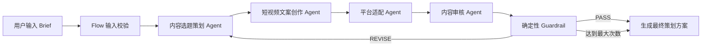

# 抖音 / 小红书多平台内容策划 Agent

基于 CrewAI Flow + Crew 和 DeepSeek 开发的多智能体内容策划系统。输入产品、目标人群、营销目标和内容风格后，系统会完成选题策划、母版文案、平台适配和内容审核，并在审核不通过时自动重写。

> 本项目基于 CrewAI 官方开源项目 `course-generator` 进行二次开发，保留上游来源与开源许可信息。

## 核心能力

- 选题策划与用户痛点分析
- 短视频口播、钩子和分镜生成
- 抖音内容适配
- 小红书种草内容适配
- 广告法风险和虚假参数检查
- Flow 状态管理
- 内容审核与自动重写
- Markdown 策划方案输出
- DeepSeek API 接入

## 系统架构



## Agent 职责

| Agent | 职责 |
| --- | --- |
| 内容选题策划 Agent | 分析用户痛点、产品卖点和选题方向 |
| 短视频文案创作 Agent | 生成标题、钩子、口播稿、分镜和 CTA |
| 平台适配 Agent | 分别输出抖音与小红书原生内容 |
| 内容审核 Agent | 检查真实性、合规性、平台差异和内容完整度 |

## Flow 与 Crew 分工

- **Crew**：负责四个专业 Agent 的顺序协作和内容生产。
- **Flow**：负责输入校验、状态保存、审核路由、错误处理和最终输出。
- **Guardrail**：在 LLM 审核之外，用确定性规则拦截未提供的数字参数和高风险营销表达，避免模型“自审自过”。

审核 Agent 必须返回：

```text
REVIEW_STATUS: PASS
```

或：

```text
REVIEW_STATUS: REVISE
```

如果审核不通过，Flow 会携带审核意见重新运行 Crew，最多执行配置的审核次数。

## 技术栈

- Python
- CrewAI
- CrewAI Flow
- DeepSeek API
- LiteLLM
- Pydantic
- Pytest

## 本地运行

### 1. 配置环境变量

```powershell
Copy-Item .env.example .env
```

编辑 `.env`：

```env
DEEPSEEK_API_KEY=你的Key
DEEPSEEK_BASE_URL=https://api.deepseek.com
DEEPSEEK_MODEL=deepseek/deepseek-chat
```

### 2. 安装

```powershell
python -m venv .venv
.\.venv\Scripts\Activate.ps1
pip install -e ".[dev]"
```

### 3. 生成内容方案

```powershell
python -m src.main "无线蓝牙耳机" `
  --audience "大学生" `
  --goal "提升购买转化" `
  --platforms "抖音,小红书" `
  --style "年轻、真实、自然" `
  --selling-points "低延迟、续航时间长、佩戴轻便"
```

生成结果保存在 `output/` 目录。

## 输出内容

最终 Markdown 包含：

1. 用户洞察和选题策略
2. 母版口播与分镜
3. 抖音标题、钩子、口播、分镜和标签
4. 小红书标题、封面、正文、卖点和标签
5. 内容审核结论和修改记录

## 自动测试

```powershell
pytest -q
```

当前测试覆盖：

- 正常 Brief 校验
- 空产品校验
- 不支持平台校验
- PASS / REVISE 审核状态识别
- 未授权量化参数检查
- 高风险营销表达检查

## 项目结构

```text
.
├── src/
│   ├── agents.py   # DeepSeek 配置与四个 Agent
│   ├── tasks.py    # 四个内容生产任务
│   ├── crew.py     # Crew 顺序编排
│   ├── flow.py     # 校验、状态、审核和重写
│   └── main.py     # CLI 入口
├── tests/
├── examples/
└── output/
```

## 后续方向

- 增加网页表单和任务执行可视化
- 加入品牌知识库和历史爆款 RAG
- 接入热点搜索工具
- 增加敏感词库和平台规则配置
- 增加内容质量评测数据集
